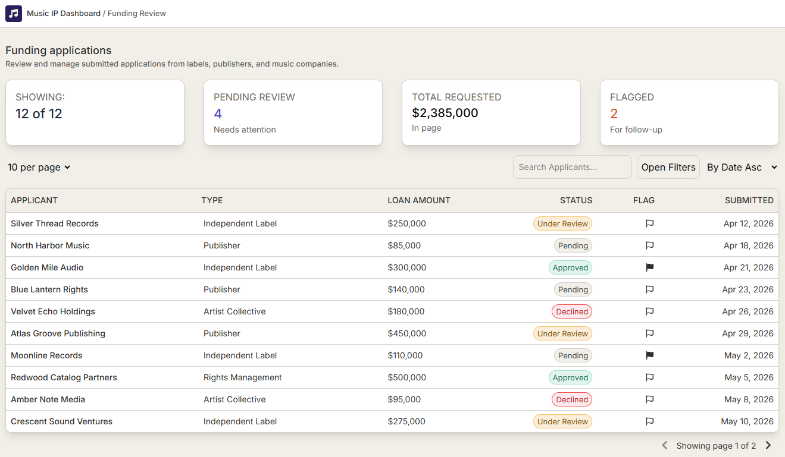
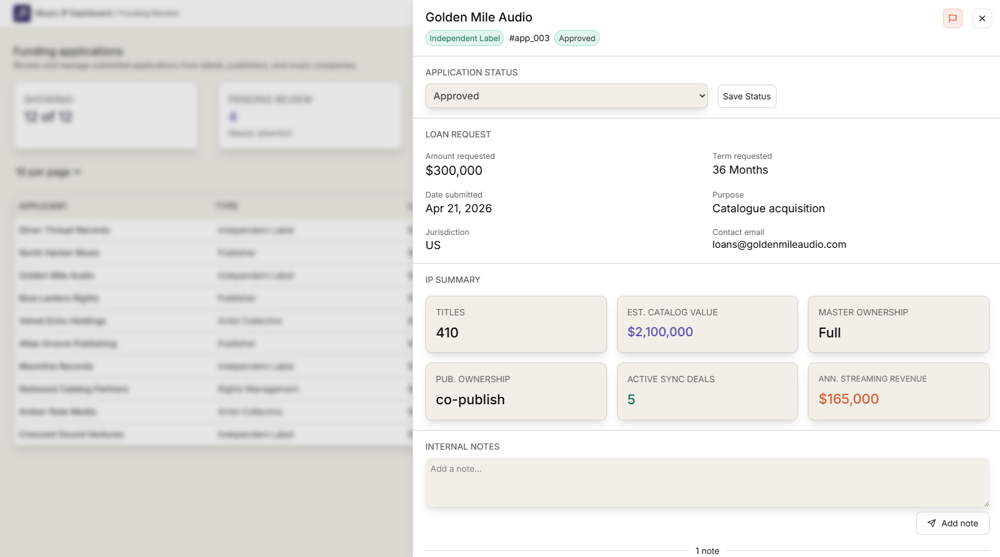
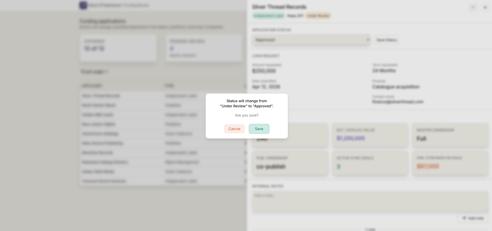
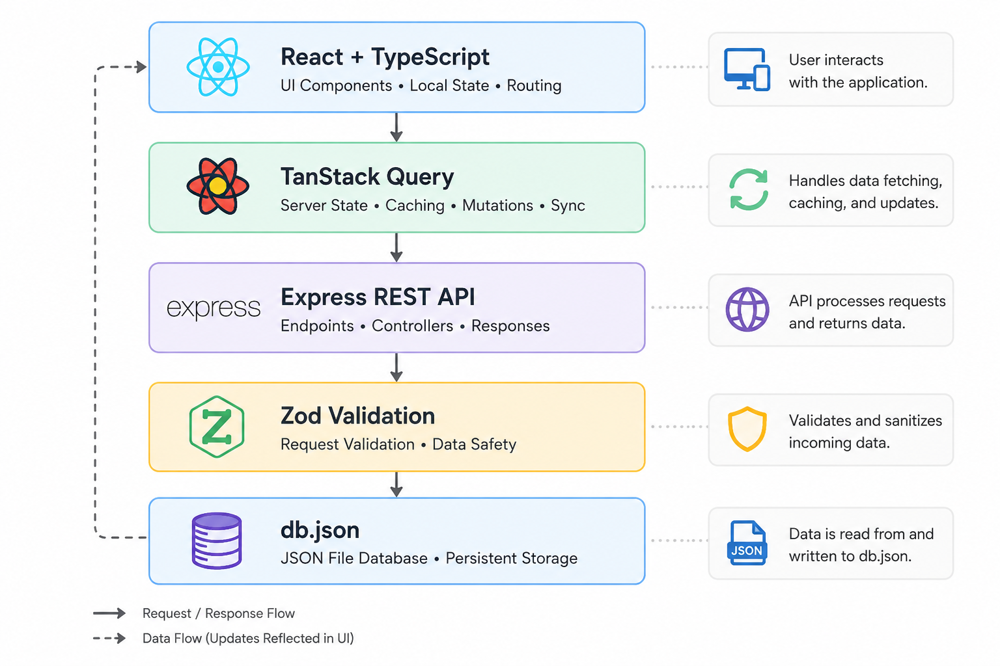

# Music IP Funding Review Dashboard

<p align="center">


</p>

An internal tool for reviewing catalogue-backed funding applications submitted by independent labels, publishers and music companies.

---

## Live Project

**Frontend:** https://music-ip-ae.vercel.app/

**Backend API:** https://musicip.onrender.com

**GitHub Repository:** https://github.com/Amit-Erez/MusicIP

---

## Contents

- [Overview](#overview)
- [Features](#features)
- [Architecture](#architecture)
- [Tech Stack](#tech-stack)
- [Testing](#testing)
- [Project Structure](#project-structure)
- [Why This Project](#why-this-project)
- [Future Improvements](#future-improvements)

# Overview

Music catalogue financing companies receive funding applications from independent labels, publishers and rights holders every day. Analysts review catalogue ownership, streaming performance, royalty income and funding requests before deciding whether an application should move forward.

This project recreates that internal workflow as a realistic business application rather than a public-facing website. Analysts can review applications, update funding decisions, leave timestamped internal notes and flag applications that require further attention.

Unlike many portfolio dashboards that only display data, this project includes a full Express backend with persistent write operations, allowing users to actively manage application data.

---

# Dashboard

> Main applications dashboard


---

# Application Review

> Slide-in review panel with status management, IP summary and internal notes



---

# Status Confirmation

> Confirmation dialog before persisting status changes



---

# Features

- Review funding applications in a sortable, paginated table
- Filter applications by review status
- Search applicants by name
- Sort by submission date or requested funding amount
- Slide-in application review panel
- Status updates with confirmation dialog
- Timestamped internal notes
- Delete notes with confirmation dialog
- One-click application flagging
- Persistent backend updates through an Express REST API
- Responsive layout for desktop and tablet
- Accessible UI built with semantic HTML and keyboard-friendly components

---

# Architecture


The project is structured as a lightweight monorepo containing separate frontend and backend applications.

The frontend communicates with an Express REST API using TanStack Query for server-state management. Rather than connecting to a relational database, the backend reads from and writes to a local JSON database (`db.json`), allowing realistic CRUD operations while keeping the MVP simple.

A production implementation would replace the JSON datastore with PostgreSQL, introduce authentication and authorization, and persist audit history for every application update.

---

# Tech Stack

## Frontend

### React

Component-based architecture for building reusable UI.

### TypeScript

Strong typing for application models, API responses and component props.

### Vite

Fast development server and optimized production builds.

### Tailwind CSS

Utility-first styling with responsive layouts.

### TanStack Query

Handles data fetching, caching, loading states, mutations and cache invalidation.

---

## Backend

### Express

REST API serving application data and write operations.

### Node.js

JavaScript runtime powering the backend.

### Zod

Runtime validation for status updates and note creation before writing to the database.

### JSON Database

Persistent storage using `db.json` for the MVP.

---

# REST API

| Method | Endpoint | Description |
|----------|----------|-------------|
| GET | `/applications` | Retrieve all funding applications |
| GET | `/applications/:id` | Retrieve application details |
| PATCH | `/applications/:id` | Toggle application flag |
| PATCH | `/applications/:id/status` | Update application status |
| POST | `/applications/:id/notes` | Create a new internal note |
| DELETE | `/applications/:id/notes/:noteId` | Delete an internal note |

---

# Testing

The frontend uses **Vitest**, **React Testing Library**, **user-event**, and **jest-dom**.

Current test coverage includes 15 component tests across:

- `SheetStatus`
  - Save Status button rendering
  - Select menu status changes
  - Save Status click handling

- `SheetNotes`
  - Existing notes rendering
  - Add Note button rendering
  - Delete button rendering
  - Textarea typing behaviour
  - Add Note click handling
  - Delete click handling

- `DeleteDialog`
  - Dialog rendering
  - Cancel behaviour
  - Delete confirmation behaviour

- `ConfirmDialog`
  - Dialog rendering
  - Cancel status-change behaviour
  - Save status-change behaviour

Run tests with:

```bash
cd Frontend
npm test
```

---

# Project Structure

```
MusicIP
│
├── Backend
│   ├── index.js          # Express API and route handlers
│   ├── db.json           # JSON mock database
│   ├── package.json
│   └── package-lock.json
│
├── Frontend
│   ├── src
│   │   ├── components
│   │   │   ├── ui        # shadcn/Radix UI primitives
│   │   │   └── *.tsx     # application components and tests
│   │   ├── lib
│   │   │   ├── api.ts    # API request functions
│   │   │   └── utils.ts
│   │   ├── App.tsx
│   │   ├── main.tsx
│   │   ├── index.css
|   |   ├── types.ts
|   |   └── vitest.setup.ts
│   ├── public
│   ├── package.json
│   └── vite.config.ts
│
└── README.md
```

---

# Running Locally

Clone the repository

```bash
git clone https://github.com/Amit-Erez/MusicIP.git
```

Install dependencies

```bash
cd backend
npm install

cd ../frontend
npm install
```

Start the backend

```bash
cd backend
npm run dev
```

Start the frontend

```bash
cd frontend
npm run dev
```

---

# Why This Project?

This project was designed to complement my earlier **Pulse** dashboard by demonstrating capabilities that project intentionally did not include.

While Pulse focused on visualising campaign analytics, Music IP Funding Review Dashboard demonstrates full-stack CRUD workflows through an Express backend, persistent write operations, REST API design, request validation and realistic business data.

My background in the music industry also allowed me to model a believable domain using concepts such as catalogue valuation, master ownership, publishing ownership, streaming revenue and sync licensing rather than relying on generic placeholder data.

---

# Future Improvements

Planned stretch features include:

- PostgreSQL database
- Prisma ORM
- JWT authentication
- Role-based permissions
- React Hook Form application intake flow
- Revenue trend charts using Recharts
- Python scoring microservice (FastAPI or Flask)
- Audit history
- Advanced search
- Bulk application actions
- End-to-end testing with Playwright

---

# Key Takeaways

This project demonstrates:

- Full-stack React + Express development
- REST API design
- Persistent CRUD operations
- Request validation with Zod
- Server-state management with TanStack Query
- Accessible UI development
- Component testing with Vitest and React Testing Library
- Realistic domain modelling using music catalogue financing data

---

## License

This project was built for educational and portfolio purposes.
